# DAI-DP 302 Experience the simplicity of SaaS for IoT (Internet of Things) with IoT Central 

Experience the simplicity of SaaS for IoT (Internet of Things), with no cloud expertise required—Azure IoT Central is a fully managed global IoT SaaS (software-as-a-service) solution that makes it easy to connect, monitor, and manage your IoT assets at scale. Bring your connected products to market faster while staying focused on your customers.

* Simplify setting up your IoT solution 
* Connect and manage your things with ease
* Rest easy with world-class security and privacy

<iframe src="https://channel9.msdn.com/Shows/Internet-of-Things-Show/Connect-real-devices-to-Microsoft-IoT-Central/player" width="960" height="540" allowFullScreen frameBorder="0"></iframe>

## Scenario

Contoso company have Connected Air Conditioner and their goal is:

* Sends telemetry such as temperature.
* Reports state such as whether it is on or off.
* Has properties such as its firmware version and serial number.
* Has settings such as its target temperature and fan speed.

In this workshop, you will learn how to build, use and administer an IoT Central application through the perspective of each of these personas.

## Administrator

### Create an application

Create your Microsoft Azure IoT Central application from the **Create Application** page. To create an Azure IoT Central application, you must complete all the fields on this page as below and then choose click the **Create** button.

For the purposes of this workshop:

* You’ll get an authentication prompt when you the click the link to the IoT Central application creation page.
* Log-in using your Microsoft Account (MSA) or your Microsoft corporate account (AAD) when you get an authentication prompt.
* You must complete all the fields on this page as below and then click the “Create” button. Choose the following values for each of the fields:
* Payment plan = “Free”
* Template = “Custom Application”
* You can choose a Name and URL of your choice.

>Note: For more information Regarding each of these fields, please click on this link:
https://docs.microsoft.com/en-us/azure/iot-central/howto-create-application

### Administer Your Application

Navigate to the Administration section by choosing Administration on the left navigation menu.

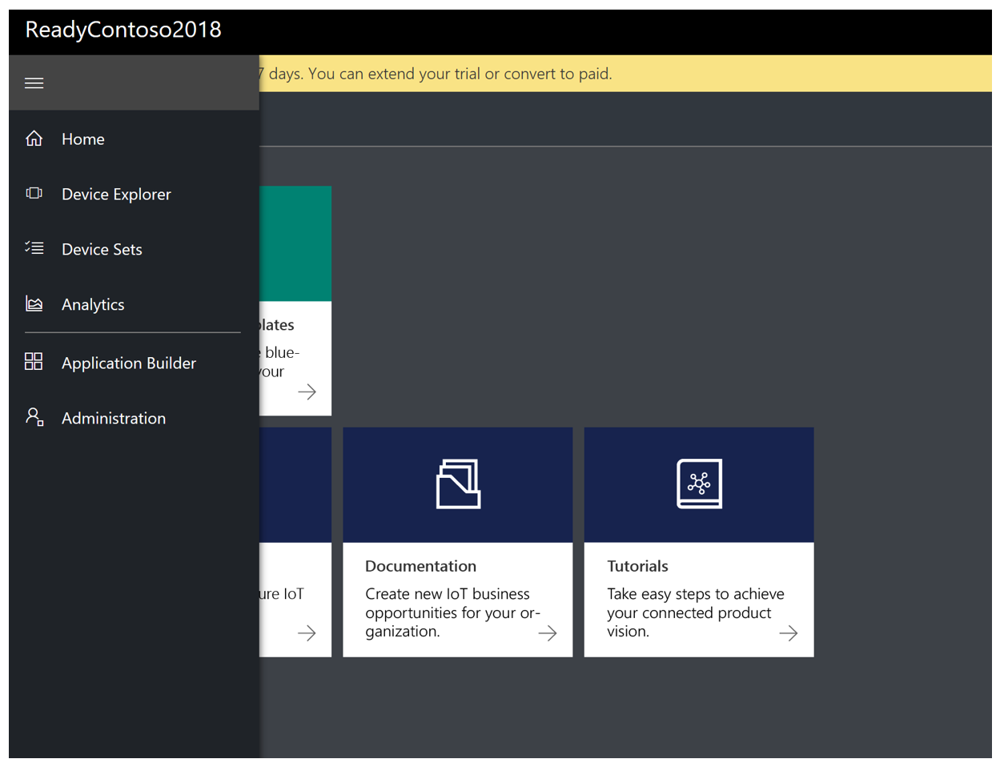

The Administration section enables you to:

* Manage users
* Manage roles
* View billing information
* Manage application settings
* Extend a free trial

Now we are going to add users as **Operators** and **Builders**

1. To add a user account to an Azure IoT Central application, use the secondary navigation menu to navigate to the Users page in the Administration section

2. On the Users page, choose “Add User” to add a user.

3. When you add a user to your Azure IoT Central application, choose a role for the user from the Role drop-down. Learn more about roles in the Roles in Azure IoT Central section of this article

>Note: To add users in bulk, enter the User IDs of all the users you'd like to add separated by semi-colons. Choose a role from the Role drop-down and choose Save.

4. After you add a user, an entry appears for that user on the Users page

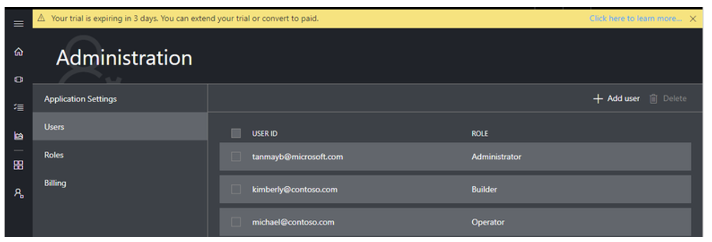

>Note: Edit the roles assigned to users. Roles cannot be changed once assigned. To change the role assigned to a user, delete the user and add the user again with a different role.

## Builder

In this section we will learn how to:

* Create a new device template
* Add telemetry to your device
* View simulated telemetry
* Define event measurement
* View simulated events
* Define state measurement
* View simulated state
* Use device properties
* Use device settings

## Create a new custom device template

As a builder, you can create and edit the device templates in your application. When you create a device template, Azure IoT Central generates a simulated device from the template. The simulated device generates telemetry that enables you to test the behavior of your application before you connect a physical device.

To add a new device template to your application, you need to go to the Application Builder page.

The following steps show you how to create a new Connected Air Conditioner device template for devices that send temperature telemetry to your application.:

1. On the Application Builder page, choose Create Device Template:

2. On the Application Builder page, choose Create Device Template:

On the Device Templates page, choose Custom. A Custom device template enables you to define all the characteristics and behaviors of your connected air conditioner

On the New Device Template page, enter Connected Air Conditioner as the name of your device, and then choose Create. You can also upload an image of your device that's visible to operators in the device explorer

In the Connected Air Conditioner device template, make sure you are on the Measurements page where you define the telemetry. Each device template you define has separate pages for you to:

* Specify the measurements, such as telemetry, event, and state, sent by the device.
* Define the settings used to control the device.
* Define the properties used to record information about the device.
* Define the rules associated with the device.
* Customize the device dashboard for your operators.

>Note: To change the name of the device or device template, click on the text at the top of the page.

To add the temperature telemetry measurement, choose New Measurement. Then choose Telemetry as the measurement type.

Each type of telemetry you define for a device template includes **configuration options** such as:

* Display options.
* Details of the telemetry.
* Simulation parameters.

To configure your Temperature telemetry, use the information in the following table:

You can also choose a color for the telemetry display. To save the telemetry definition, choose **Save**.

After a short while, the Measurements page shows a chart of the temperature telemetry from your simulated connected air conditioner device. Use the controls to manage visibility, aggregation, or to edit the telemetry definition.

You can also customize the chart using the Line, Stacked, and Edit Time Range controls.

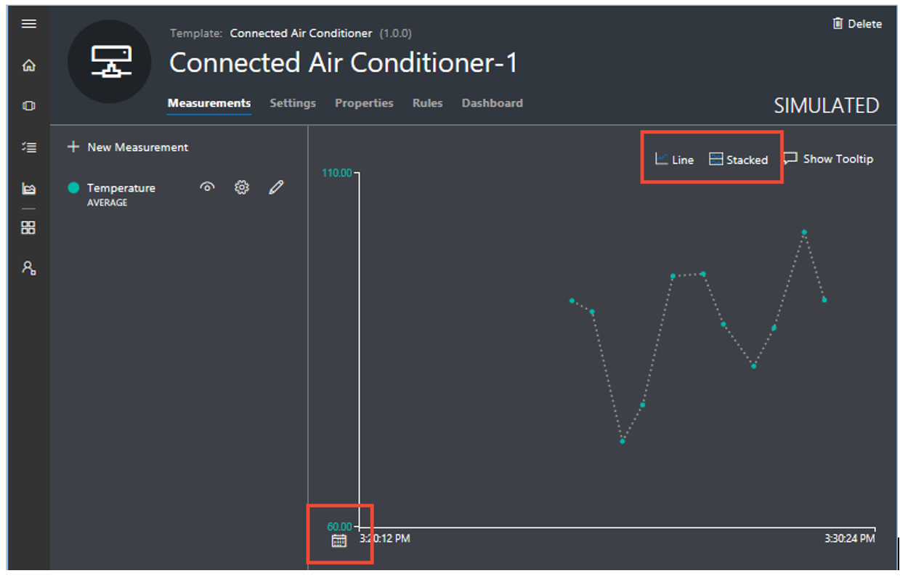

### Define Event measurement

You can use Event to define point-in-time data that is sent by the device to signify something of significance like an error or a component failure. Like telemetry measurements, Azure IoT Central can simulate device events to enable you to test the behavior of your application before you connect a physical device. You define event measurements for your device type in the Measurements view.
To add the Fan Motor Error event measurement, choose New Measurement. Then choose Event as the measurement type.

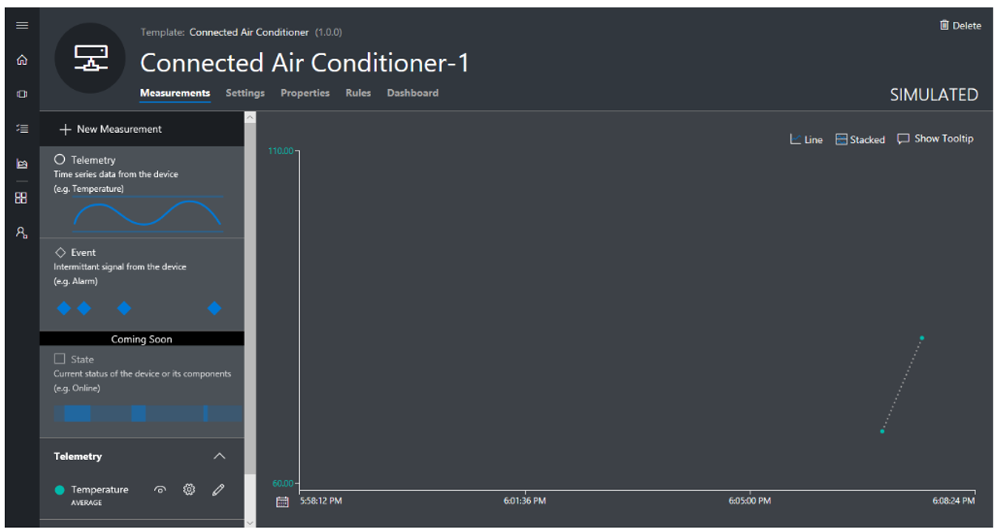

Each type of Event you define for a device template includes **configuration options** such as:

* Display Name.
* Field Name.
* Severity.

To configure your Fan Motor Error event, use the information in the following table:

To save the event definition, choose **Save**

After a short while, the Measurements page shows a chart of the events randomly generated from your simulated connected air conditioner device. Use the controls to manage visibility, or to edit the event definition.

To see additional details about the event, click the event on the chart.

### Define State measurement

You can use State to define and visualize the state of the device or its component over a period of time. Like telemetry measurements, Azure IoT Central can simulate device state to enable you to test the behavior of your application before you connect a physical device. You define state measurements for your device type in the Measurements view.

To add Fan Mode measurement, choose New Measurement. Then choose State as the measurement type.

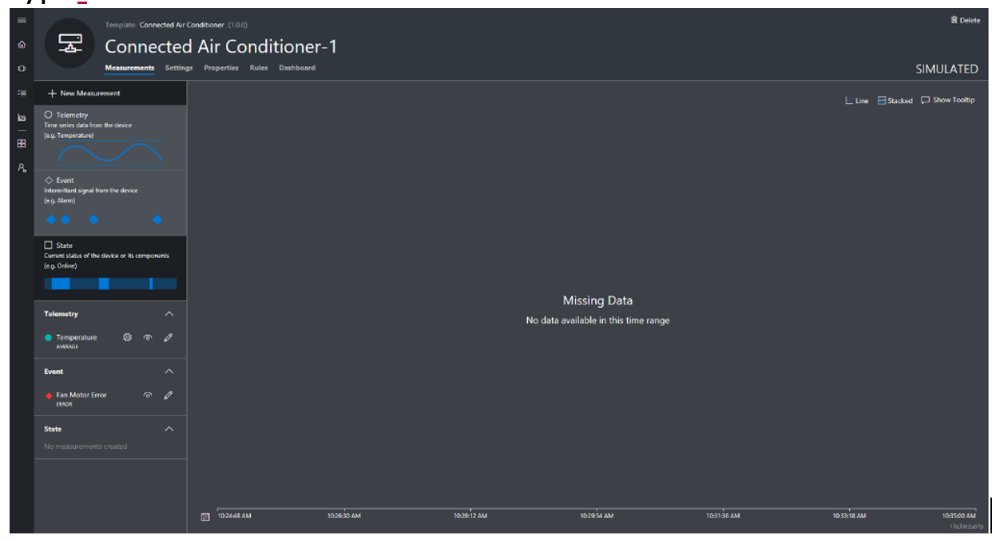

Each type of State you define for a device template includes configuration options such as:

* Display Name.
* Field Name.
* Values with optional display labels.
* Color for each value

To configure your Fan Mode state, use the information in the following table:

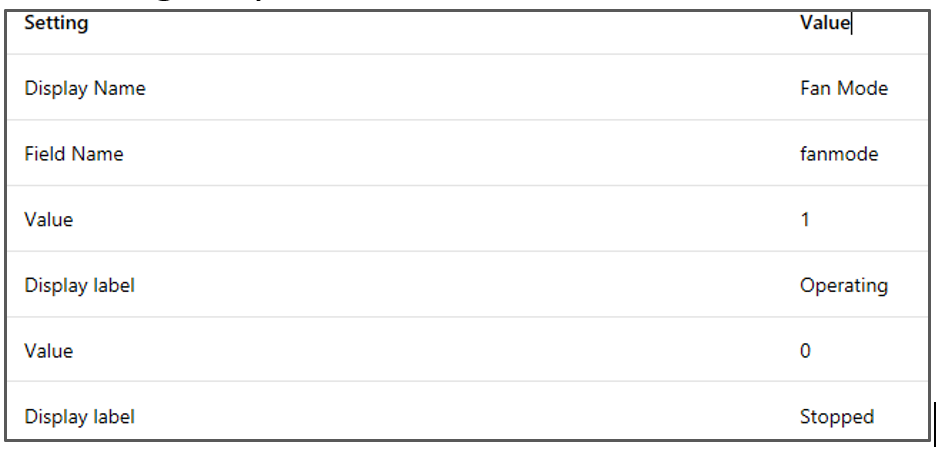

To save the state measurement definition, choose **Save**.

After a short while, the Measurements page shows a chart of the states randomly generated from your simulated connected air conditioner device. Use the controls to manage visibility, or to edit the state definition.

In case, there are too many data points sent by the device within a small duration, the state measurement is shown with a different visual as shown below. If you click on the chart, then all the data points within that time- period are displayed in a chronological order. You can also narrow down the time range so see the measurement plotted on the chart.

### Properties, device properties, and settings

Properties, device properties, and settings are different values defined in a device template and associated with each individual device:

* You use settings to send configuration data to a device from your application. For example, an operator could use a setting to change the device's telemetry interval from two seconds to five seconds. When an operator changes a setting, the setting is marked as pending in the UI until the device acknowledges that it has actioned the setting change.
* You use properties to record information about your device in your application. For example, you can use properties to record a device's serial number or the device manufacturer's phone number. Properties are stored in the application and do not synchronize with the device. An operator can assign values to properties.
* You use device properties to enable a device to send property values to your application. These properties can only be changed by the device. For an operator, device properties are read-only.

### Use settings

You use settings to enable an operator to send configuration data to a device. In this section, you add a setting to your Connected Air Conditioner device template that enables an operator to set the target temperature of the connected air conditioner. 
Navigate to the Settings page for your Connected Air Conditioner device template.:

>Note: if the Design Mode is set to off, please set it to **On**.

1. You can create settings of different types such as numbers or text.
2. Choose Number to add a number setting to your device.
3. To configure your Set Temperature setting, use the information in the following table:

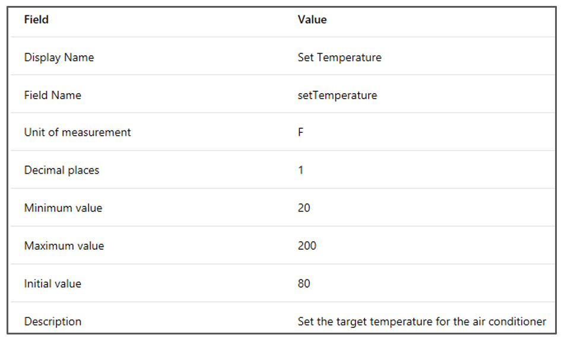

Then choose **Save**

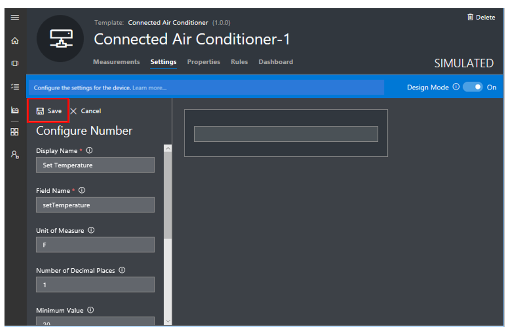

>Note: When the device acknowledges a setting change, the status of the setting changes to synced.

You can customize the layout of the Settings page by moving and resizing settings tiles.

### Use properties / device properties

You use properties to store information about your device in the application. In this section, you add device properties to your Connected Air Conditioner device template to store the device serial number and firmware version. Note that both of these are read-only properties reported by the device -- you cannot assign values to them. Properties you might use that you can assign values to include the location of the device, ownership information, and the last service date/time for the device.

Navigate to the Properties page for your Connected Air Conditioner device template.

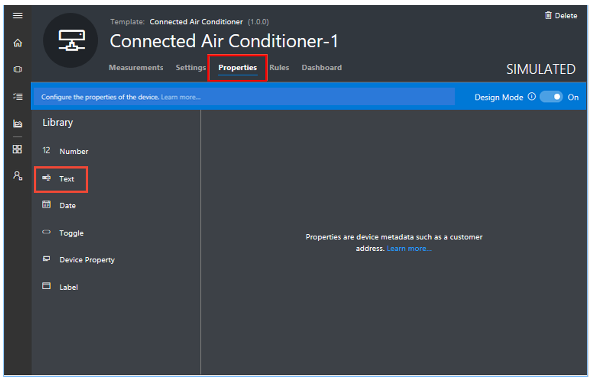

1. You can create device properties of different types such as numbers or text. To add a serial number property to your device template, choose Text.

2. To configure your serial number property, use the information in the following table

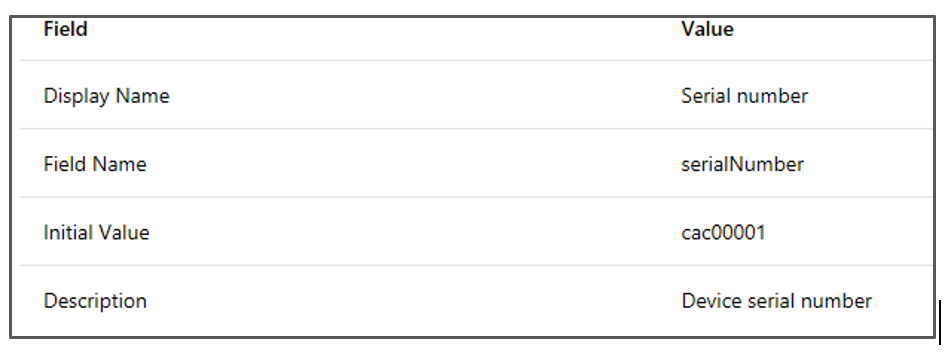

Leave other fields with their default values.

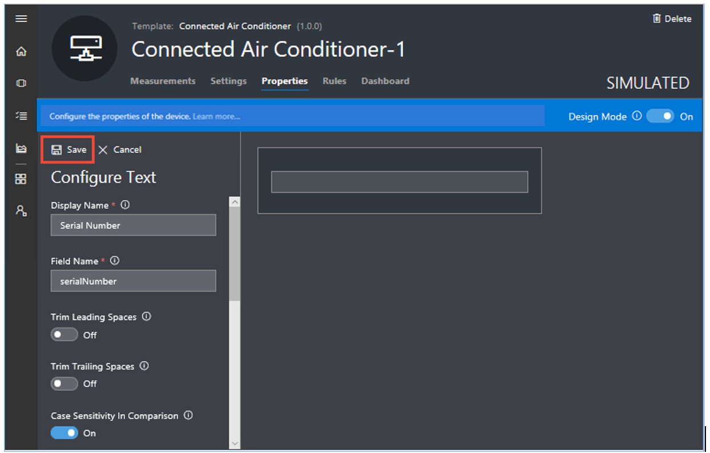

1. Choose **Save**.
2. To add a firmware version to the device properties for your device template, choose Text.
3. To configure your firmware version device property, use the information in the following table:

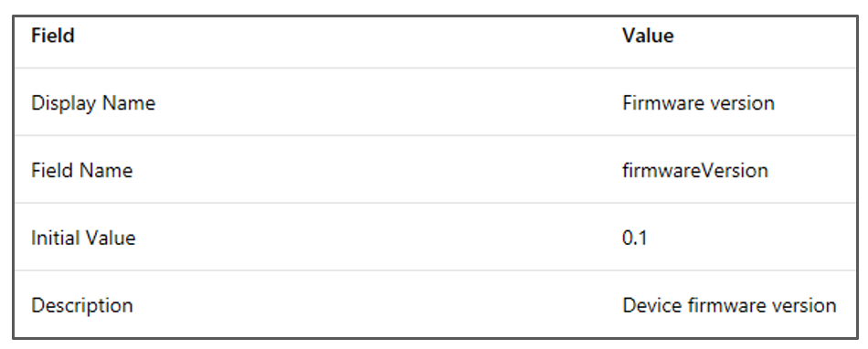

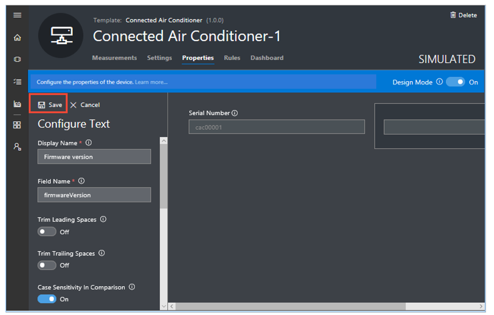

Choose **Save**.

You can customize the layout of the Properties page by moving and resizing property tiles.

### Use commands 

You use commands to enable an operator to run commands directly on the device. In this section, you add a command to your Connected Air Conditioner device template that enables an operator to echo a certain message on the the connected air conditioner display (this works with MxChip sample code).

1. Navigate to the Commands page for your Connected Air Conditioner device template.:

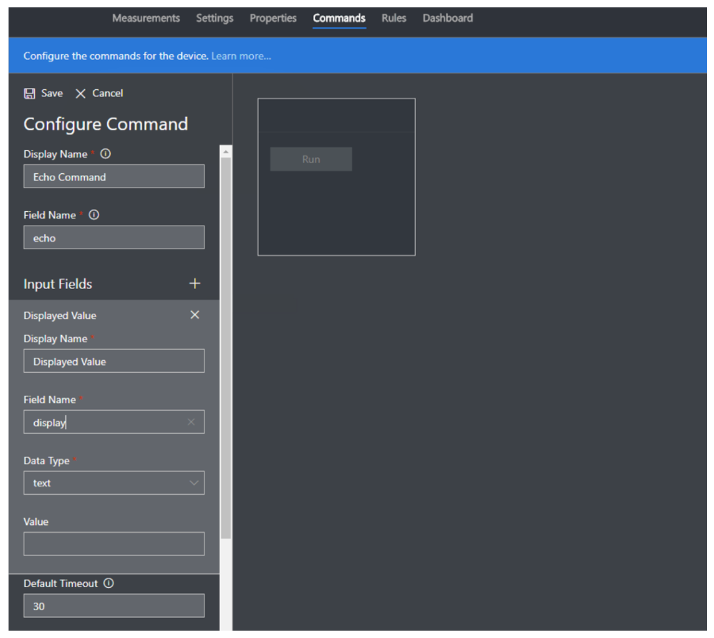

You can create commands of different types based on your requirements.

2. Click New Command to add a command to your device.
3. To configure your new command, use the information in the following table

You can add additional inputs to the command by clicking + for inputs.

Choose **Save**.

You can customize the layout of the Commands page by moving and resizing commands tile

### View your simulated device

Now you have defined your Connected Air Conditioner device template, you can customize its Dashboard to include the measurements, settings, and properties you defined. Then you can preview the dashboard as an operator.:
Choose the Dashboard page for your Connected Air Conditioner device template.

Choose Line Chart to add the component onto the Dashboard.

Configure the Line Chart component using the information in the following table

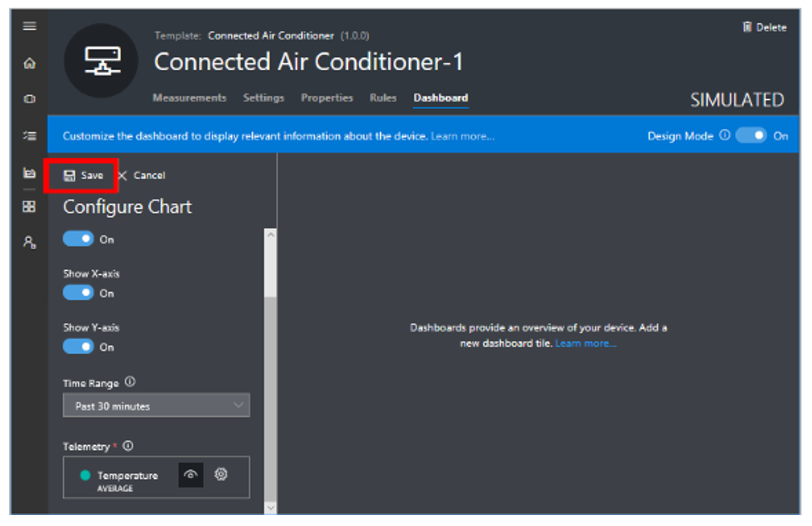

Then choose **Save**.

Configure the Event Chart component using the information in the following table

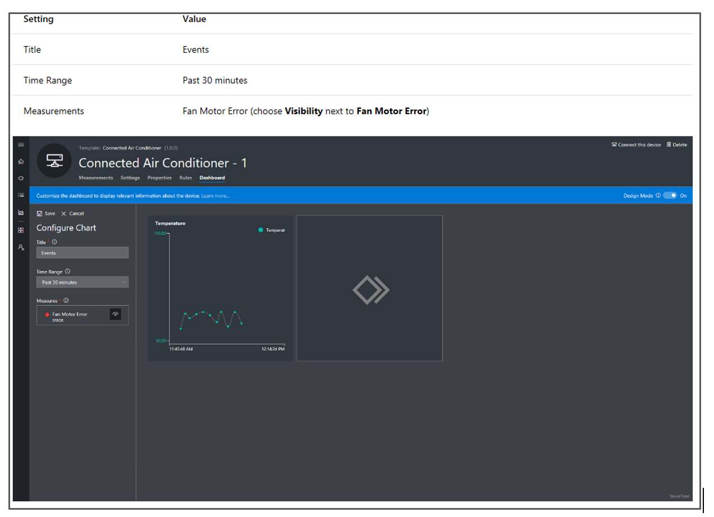

Then choose **Save**.

Configure the State Chart component using the information in the following table.

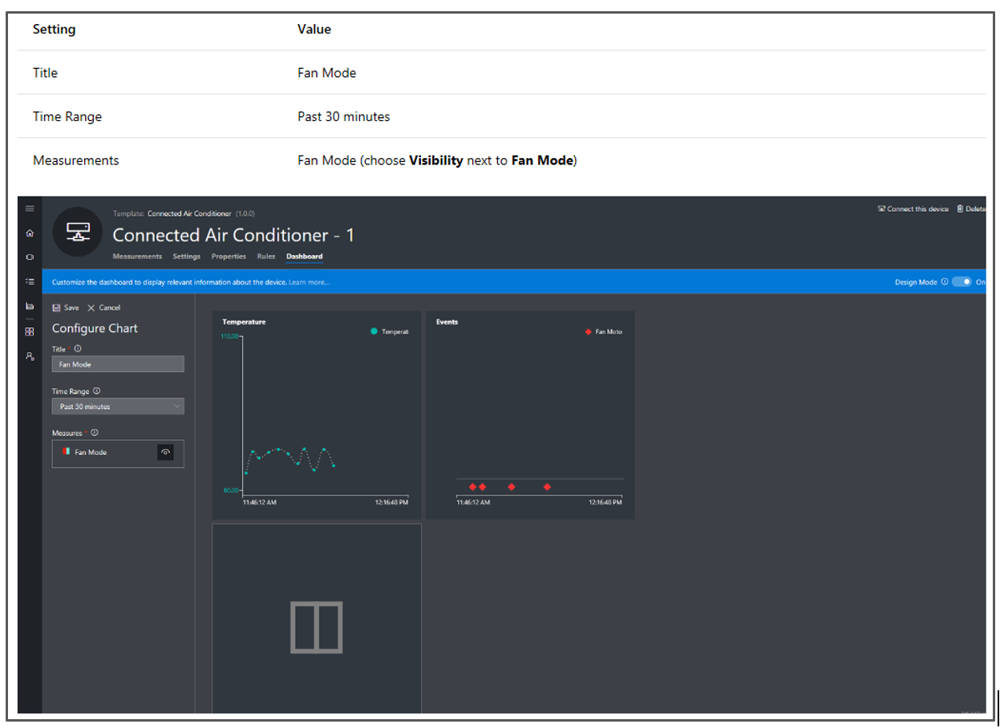

Then choose **Save**.

To add the set temperature setting to the dashboard, choose Settings and Properties

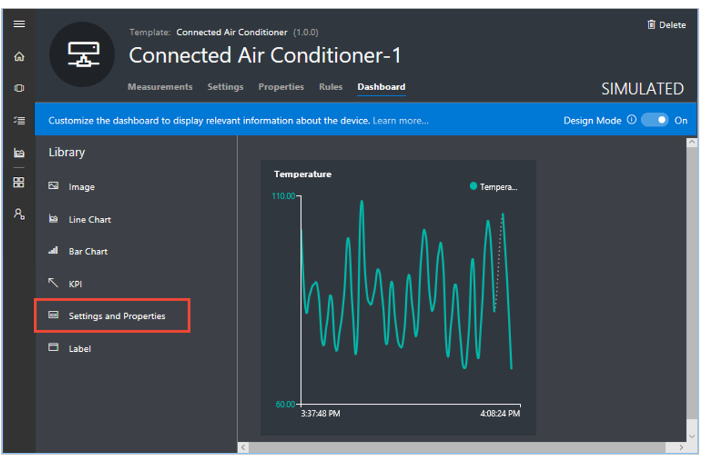

Configure the Settings and Properties component. : Choose:
1.	Set Temperature
2.	Firmware Version
3.	Serial Number

Then choose **Save**.

To view the dashboard as an operator, switch off Design Mode on the top right of the page

### Configure rules

To start adding a rule in the Rules view, choose Rules

