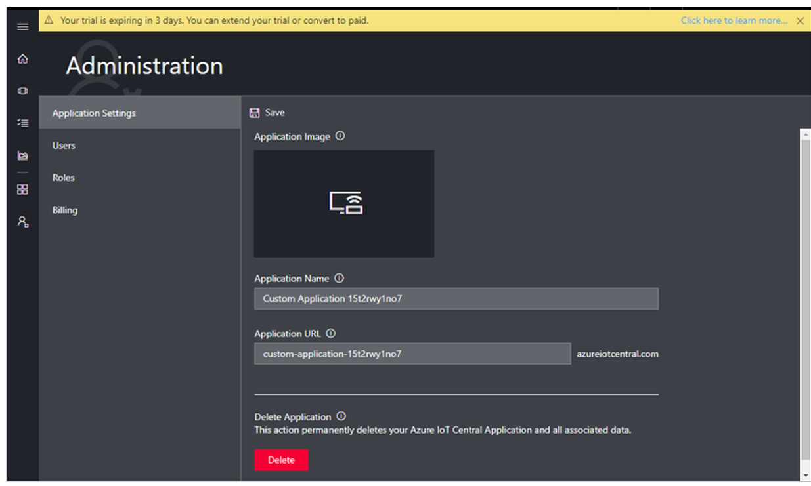
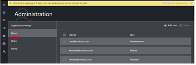

# DAI-DP 302 Experience the simplicity of SaaS for IoT (Internet of Things) with IoT Central 

Experience the simplicity of SaaS for IoT (Internet of Things), with no cloud expertise required—Azure IoT Central is a fully managed global IoT SaaS (software-as-a-service) solution that makes it easy to connect, monitor, and manage your IoT assets at scale. Bring your connected products to market faster while staying focused on your customers.

* Simplify setting up your IoT solution 
* Connect and manage your things with ease
* Rest easy with world-class security and privacy

<iframe src="https://channel9.msdn.com/Shows/Internet-of-Things-Show/Connect-real-devices-to-Microsoft-IoT-Central/player" width="960" height="540" allowFullScreen frameBorder="0"></iframe>

## Scenario

Contoso company have Connected Air Conditioner and their goal is:

* Sends telemetry such as temperature.
* Reports state such as whether it is on or off.
* Has properties such as its firmware version and serial number.
* Has settings such as its target temperature and fan speed.

In this workshop, you will learn how to build, use and administer an IoT Central application through the perspective of each of these personas.

## Administrator

### Create an application

Create your Microsoft Azure IoT Central application from the **Create Application** page. To create an Azure IoT Central application, you must complete all the fields on this page as below and then choose click the **Create** button.

For the purposes of this workshop:

* You’ll get an authentication prompt when you the click the link to the IoT Central application creation page.
* Log-in using your Microsoft Account (MSA) or your Microsoft corporate account (AAD) when you get an authentication prompt.
* You must complete all the fields on this page as below and then click the “Create” button. Choose the following values for each of the fields:
* Payment plan = “Free”
* Template = “Custom Application”
* You can choose a Name and URL of your choice.

>Note: For more information Regarding each of these fields, please click on this link:
https://docs.microsoft.com/en-us/azure/iot-central/howto-create-application

### Administer Your Application

Navigate to the Administration section by choosing Administration on the left navigation menu.

The Administration section enables you to:

* Manage users
* Manage roles
* View billing information
* Manage application settings
* Extend a free trial

Now we are going to add users as **Operators** and **Builders**

1. To add a user account to an Azure IoT Central application, use the secondary navigation menu to navigate to the Users page in the Administration section

2. On the Users page, choose “Add User” to add a user.

3. When you add a user to your Azure IoT Central application, choose a role for the user from the Role drop-down. Learn more about roles in the Roles in Azure IoT Central section of this article

>Note: To add users in bulk, enter the User IDs of all the users you'd like to add separated by semi-colons. Choose a role from the Role drop-down and choose Save.
