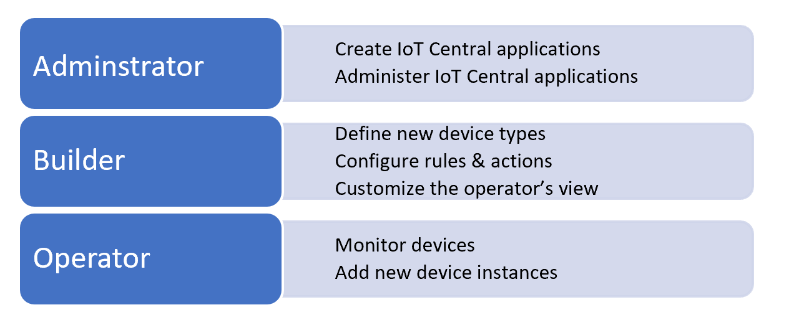
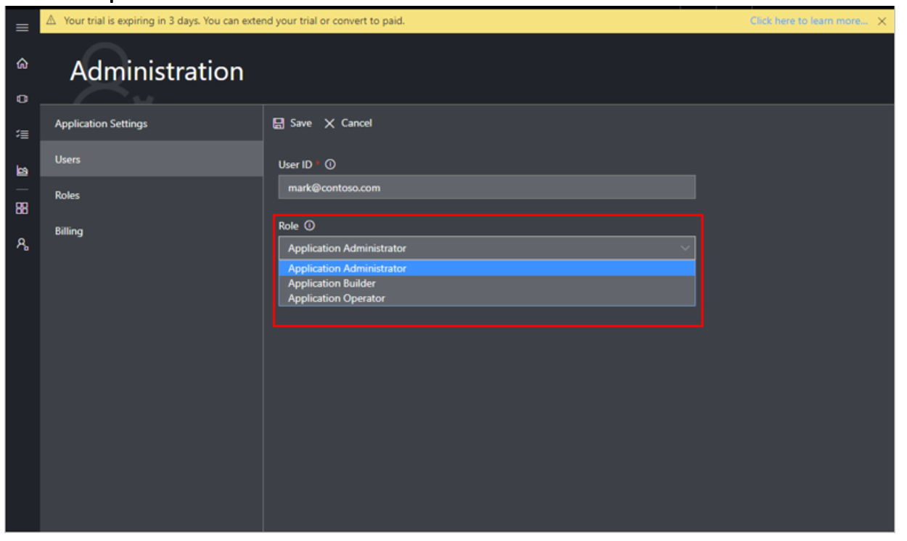
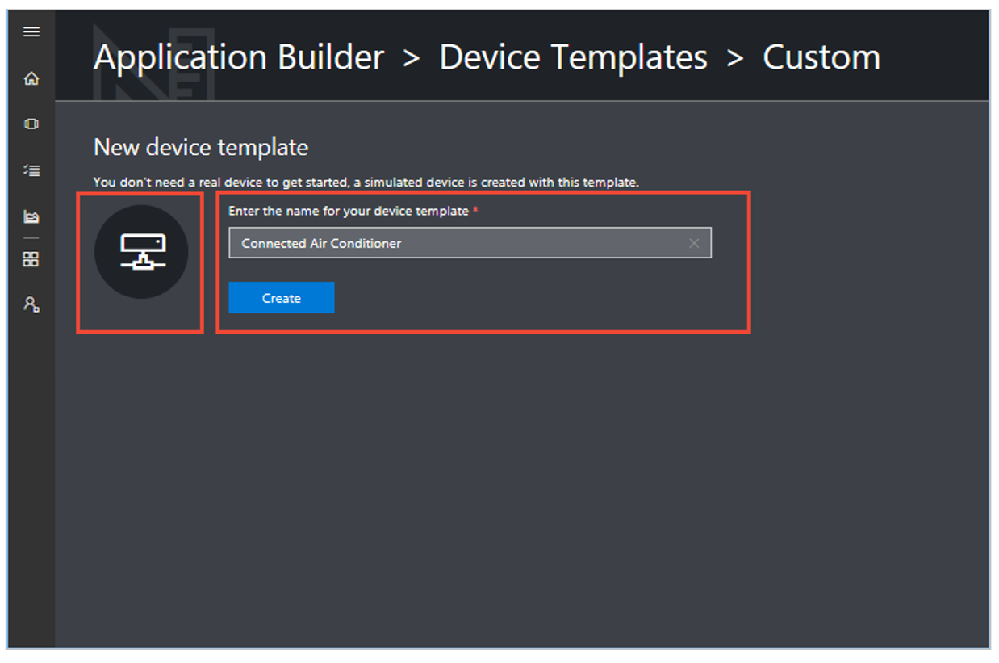
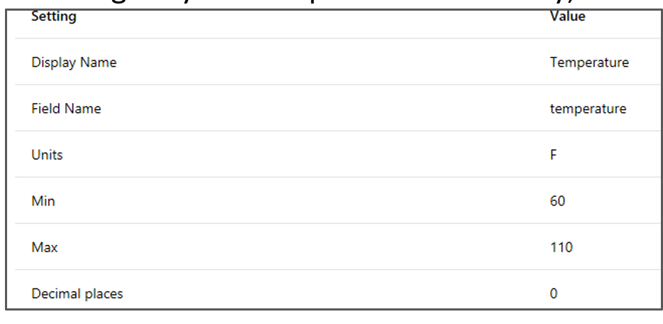

# DAI-DP 302 Experience the simplicity of SaaS for IoT (Internet of Things) with IoT Central 

Experience the simplicity of SaaS for IoT (Internet of Things), with no cloud expertise required—Azure IoT Central is a fully managed global IoT SaaS (software-as-a-service) solution that makes it easy to connect, monitor, and manage your IoT assets at scale. Bring your connected products to market faster while staying focused on your customers.

* Simplify setting up your IoT solution 
* Connect and manage your things with ease
* Rest easy with world-class security and privacy

<iframe src="https://channel9.msdn.com/Shows/Internet-of-Things-Show/Connect-real-devices-to-Microsoft-IoT-Central/player" width="960" height="540" allowFullScreen frameBorder="0"></iframe>

## Scenario

Contoso company have Connected Air Conditioner and their goal is:

* Sends telemetry such as temperature.
* Reports state such as whether it is on or off.
* Has properties such as its firmware version and serial number.
* Has settings such as its target temperature and fan speed.

In this workshop, you will learn how to build, use and administer an IoT Central application through the perspective of each of these personas.

## Administrator

### Create an application

Create your Microsoft Azure IoT Central application from the **Create Application** page. To create an Azure IoT Central application, you must complete all the fields on this page as below and then choose click the **Create** button.

For the purposes of this workshop:

* You’ll get an authentication prompt when you the click the link to the IoT Central application creation page.
* Log-in using your Microsoft Account (MSA) or your Microsoft corporate account (AAD) when you get an authentication prompt.
* You must complete all the fields on this page as below and then click the “Create” button. Choose the following values for each of the fields:
* Payment plan = “Free”
* Template = “Custom Application”
* You can choose a Name and URL of your choice.

>Note: For more information Regarding each of these fields, please click on this link:
https://docs.microsoft.com/en-us/azure/iot-central/howto-create-application

### Administer Your Application

Navigate to the Administration section by choosing Administration on the left navigation menu.

The Administration section enables you to:

* Manage users
* Manage roles
* View billing information
* Manage application settings
* Extend a free trial

Now we are going to add users as **Operators** and **Builders**

1. To add a user account to an Azure IoT Central application, use the secondary navigation menu to navigate to the Users page in the Administration section

2. On the Users page, choose “Add User” to add a user.

3. When you add a user to your Azure IoT Central application, choose a role for the user from the Role drop-down. Learn more about roles in the Roles in Azure IoT Central section of this article

>Note: To add users in bulk, enter the User IDs of all the users you'd like to add separated by semi-colons. Choose a role from the Role drop-down and choose Save.

4. After you add a user, an entry appears for that user on the Users page

>Note: Edit the roles assigned to users. Roles cannot be changed once assigned. To change the role assigned to a user, delete the user and add the user again with a different role.

## Builder

In this section we will learn how to:

* Create a new device template
* Add telemetry to your device
* View simulated telemetry
* Define event measurement
* View simulated events
* Define state measurement
* View simulated state
* Use device properties
* Use device settings

## Create a new custom device template

As a builder, you can create and edit the device templates in your application. When you create a device template, Azure IoT Central generates a simulated device from the template. The simulated device generates telemetry that enables you to test the behavior of your application before you connect a physical device.

To add a new device template to your application, you need to go to the Application Builder page.

The following steps show you how to create a new Connected Air Conditioner device template for devices that send temperature telemetry to your application.:

1. On the Application Builder page, choose Create Device Template:

2. On the Application Builder page, choose Create Device Template:

On the Device Templates page, choose Custom. A Custom device template enables you to define all the characteristics and behaviors of your connected air conditioner

On the New Device Template page, enter Connected Air Conditioner as the name of your device, and then choose Create. You can also upload an image of your device that's visible to operators in the device explorer

In the Connected Air Conditioner device template, make sure you are on the Measurements page where you define the telemetry. Each device template you define has separate pages for you to:

* Specify the measurements, such as telemetry, event, and state, sent by the device.
* Define the settings used to control the device.
* Define the properties used to record information about the device.
* Define the rules associated with the device.
* Customize the device dashboard for your operators.

>Note: To change the name of the device or device template, click on the text at the top of the page.

To add the temperature telemetry measurement, choose New Measurement. Then choose Telemetry as the measurement type.

Each type of telemetry you define for a device template includes **configuration options** such as:

* Display options.
* Details of the telemetry.
* Simulation parameters.

To configure your Temperature telemetry, use the information in the following table:

You can also choose a color for the telemetry display. To save the telemetry definition, choose **Save**.

After a short while, the Measurements page shows a chart of the temperature telemetry from your simulated connected air conditioner device. Use the controls to manage visibility, aggregation, or to edit the telemetry definition
