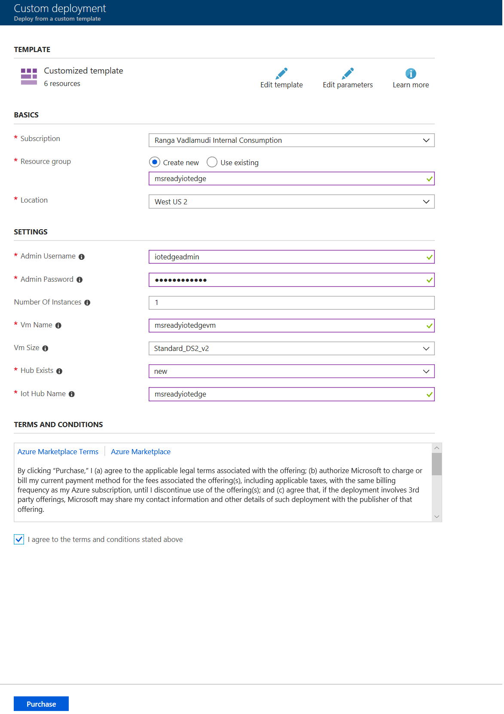
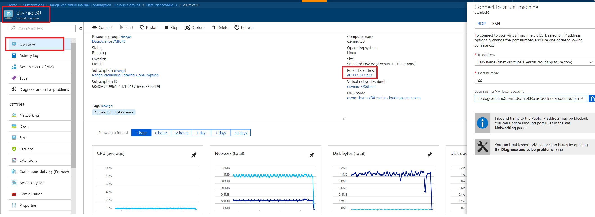
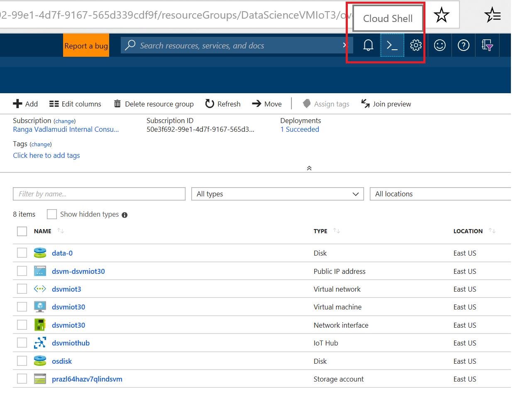
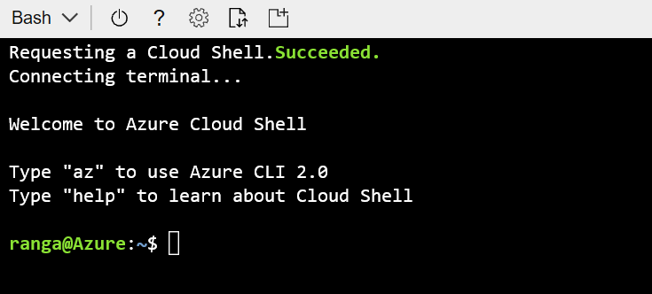
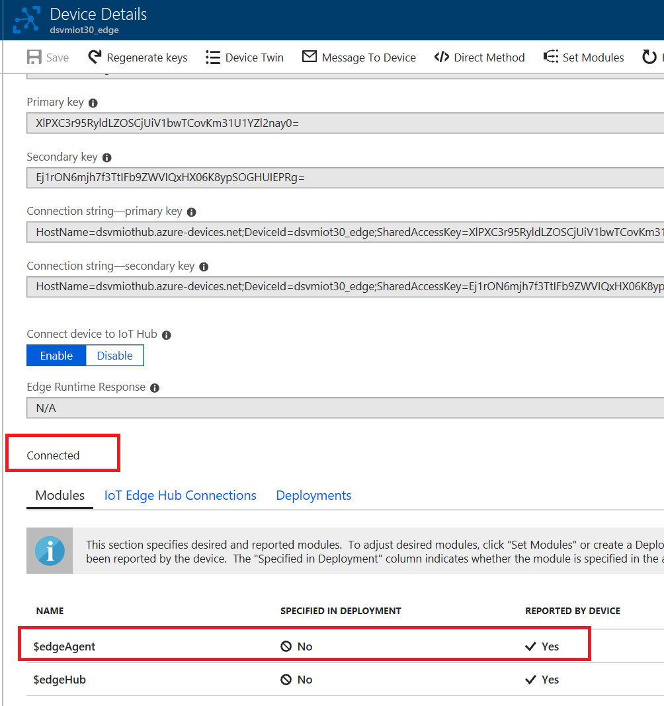

# DAI-DP308 Take it to the Edge!  (IoT Edge, AI, Machine Learning and Cognitive Services )

Azure IoT Edge is an Internet of Things (IoT) service that builds on top of IoT Hub. This service is meant for customers who want to analyze data on devices, a.k.a. "at the edge", instead of in the cloud. By moving parts of your workload to the edge, your devices can spend less time sending messages to the cloud and react more quickly to changes in status.

Azure IoT Edge moves cloud analytics and custom business logic to devices so that your organization can focus on business insights instead of data management. Enable your solution to truly scale by configuring your IoT software, deploying it to devices via standard containers, and monitoring it all from the cloud.

<iframe src="https://channel9.msdn.com/Shows/Internet-of-Things-Show/Kubernetes-integration-with-Azure-IoT-Edge/player" width="480" height="270" allowFullScreen frameBorder="0"></iframe>

## Standup Edge enabled VM on Azure

For this workshop you will standup Data Science Ubuntu VM and this VM will be the IoT Edge Device.

Go to [Github Project](
https://github.com/Azure/DataScienceVM/tree/master/Extensions/Iot
) and click **Deploy To Azure**. This will install a Data Science VM which is IoT Edge enabled.



Fill out the above form and click **Purchase**. For this workshop create a new IoT Hub for each VM you create.

Once the deployment is completed go to the resource group created and you will see a VM and IoT Hub have been created.

Click on the VM deployed and copy the public IP of the VM



SSH into the VM using Cloud Shell



You will SSH into the VM from here



SSH into VM


After login is complete in the cloud shell if you have multiple subscriptions make sure your subscription is set to the one where your VM is deployed. Otherwise use the following command and set the subscription where the VM is deployed.

```code
az login
az account set -s "subscription id"
## To set the correct one
```

Go to /home/"user"/IotEdge


Run

```code
$ bash edge_configure.sh
```


You will be prompted to open a browser and device login. Enter the code provided in the browser and when prompted to login enter your user and password.

Make sure VM is configured to be edge device

Run

```code
iotedge list
```


Check that your device is paired with Iot Hub




### Deploy a custom module

Deploy temperator sensor simulation custom module from Docker Hub. Fom Azure Portal go to IoT Hub and select the device you setup. Click on **Set Modules**. Add IoT Edge Module.


Click **Next** twice and **Submit**

Verify if temperature sensor module is deployed on the device


Verify if data is being generated and sentemp sensor module is deployed

```
$ docker logs -f tempsensor
```


Verify data is being sent upstream to Iot Hub


### Create Azure Kubernetes Service

Click on Create a resource


Click on **Containers** and **Kubernetes Service**


Create Kubernetes service in the existing resource group with 3 VMs. Click **Review+Create**


Review the deployment and click **Create**


Kubernetes cluster is created in a few minutes


Run the following command in **cloud shell** to get credentials

```code
az acs kubernetes get-credentials --resource-group=<cluster-resource-group> --name=<cluster-name>
```

Test Kubectl

Run
```code
$ kubectl get pods
```