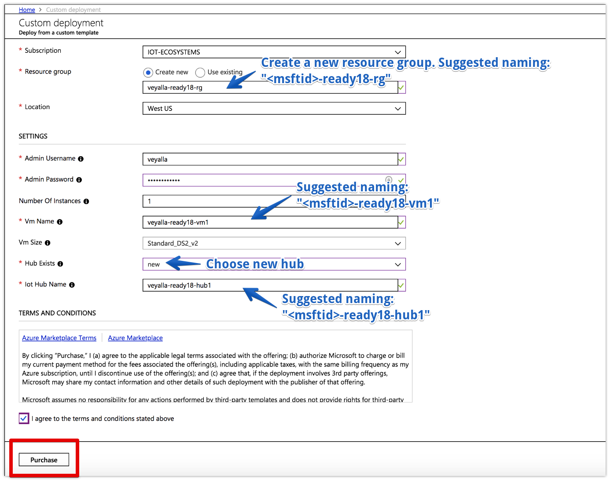
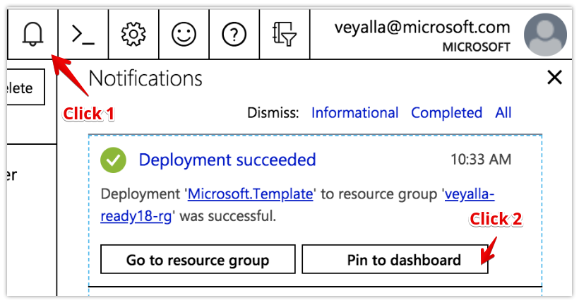
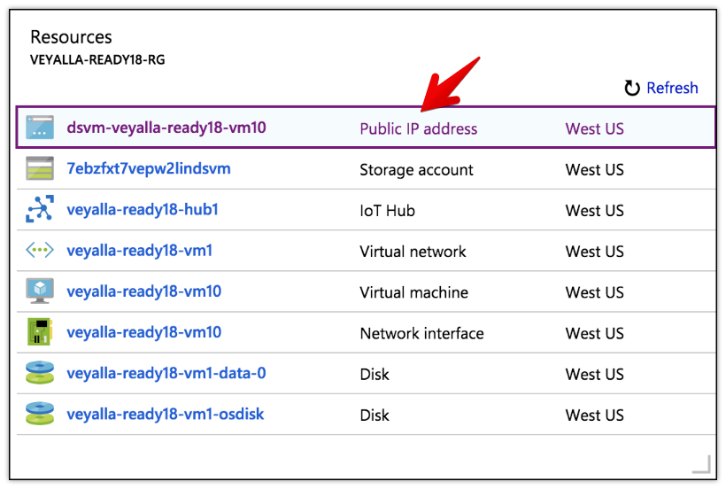
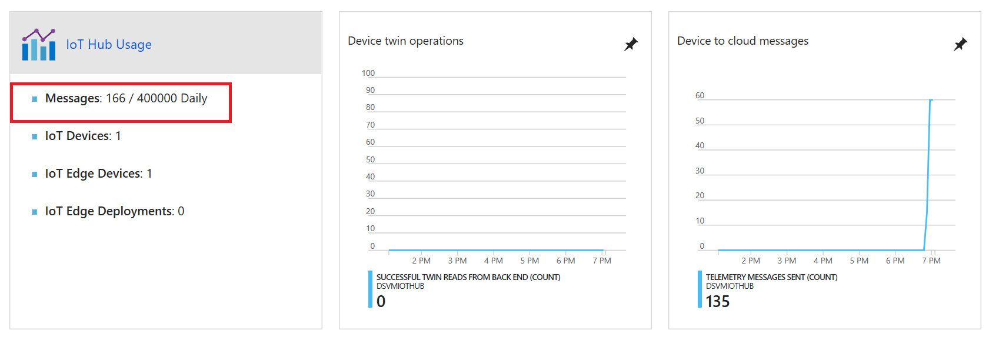
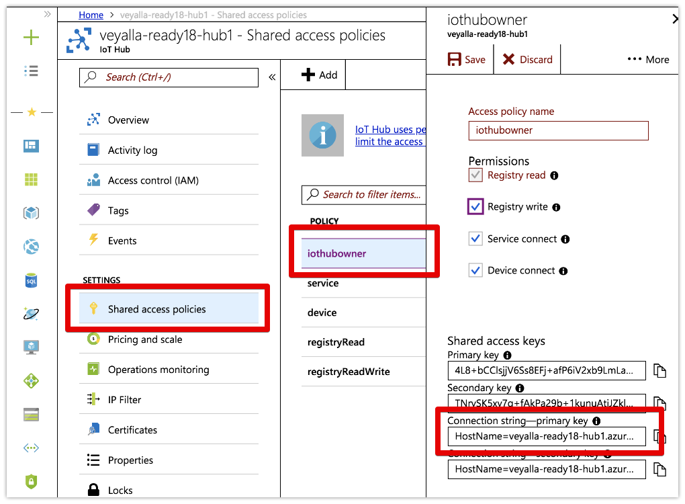
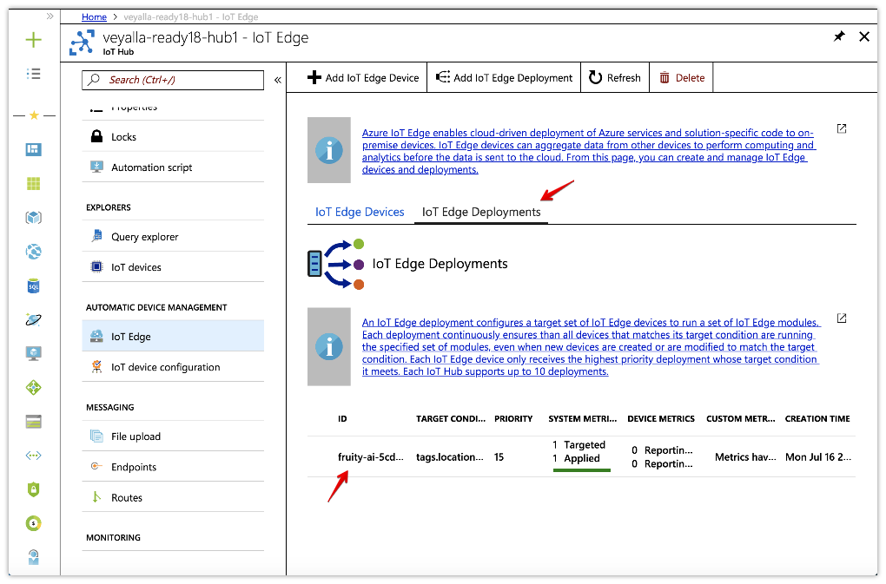

# DAI-DP308 Take it to the Edge!  (IoT Edge, AI, Machine Learning and Cognitive Services )

Azure IoT Edge is an Internet of Things (IoT) service that builds on top of IoT Hub. This service is meant for customers who want to analyze data on devices, a.k.a. "at the edge", instead of in the cloud. By moving parts of your workload to the edge, your devices can spend less time sending messages to the cloud and react more quickly to changes in status.

Azure IoT Edge moves cloud analytics and custom business logic to devices so that your organization can focus on business insights instead of data management. Enable your solution to truly scale by configuring your IoT software, deploying it to devices via standard containers, and monitoring it all from the cloud.

<iframe src="https://channel9.msdn.com/Shows/Internet-of-Things-Show/Kubernetes-integration-with-Azure-IoT-Edge/player" width="480" height="270" allowFullScreen frameBorder="0"></iframe>

## Milestone 1: Standup Edge enabled VM on Azure

For this workshop you will standup Data Science Ubuntu VM and this VM will be the IoT Edge Device.

Go to [Github Project and click **Deploy To Azure**](
https://github.com/Azure/DataScienceVM/tree/master/Extensions/Iot
). This will install a Data Science VM which is IoT Edge enabled.

Fill out the custom deployment form per guidance in the figure below and click **Purchase**. 



The custom deployment will complete the following operations for you:

1. Stand up an Data Science VM and IoT Hub.
2. Install the [IoT Edge runtime](https://docs.microsoft.com/en-my/azure/iot-edge/how-to-install-iot-edge-linux) and [*az* CLI](https://docs.microsoft.com/en-us/cli/azure/?view=azure-cli-latest) in the VM.
3. Open ports to allow SSH access to the Data science VM.

Once the deployment is completed, pin it to your dashboard and you will see a VM and IoT Hub resources in the tile.



From the dashboard tile, click the "Public IP address" resource.



Copy the IP address from the page.


Open Cloud Shell from your Azure portal. You will SSH into the VM from here.


SSH into VM using copied IP address along with Username and Password you provided in the custom deployment form.

```bash
ssh <username>@<public-ip>
```


*If you use only one Azure subsciption, you can skip this step.* Otherwise, ensure your subscription is set to the one where the VM and IoT Hub were deployed.

 ```bash
 az login --use-device-code
 az account set -s "replace-with-subscription-name-used-for-vm-and-iothub"
 ```
 >The commands above, if needed, should be run in SSH session of the VM, **not** in the default cloud shell environment.

In the SSH session, cd to **IotEdge** directory and execute **edge_configure.bat**

```bash
cd /home/${USER}/IotEdge
bash edge_configure.sh
```


Click on the device login link and enter the displayed code in the web page.

 **edge_configure.sh** performs the following steps:

1. Creates an Edge device named "*vmhostname*_edge" in the IoT Hub using *az* CLI.
2. Associates the VM with the Edge device identity.

Run the command below and confirm the **edgeAgent** module is running.

```bash
sudo iotedge list
```


Congratulations, you have completed Milestone 1! On to the next...

## Milestone 2: Deploy a custom module

In this milestone, we'll deploy a simulated temperature sensor module on the Edge device. 

1. From your pinned resource group tile, go to the IoT Hub resource and click on the **IoT Edge** blade.
1. Click on the Edge Device ID to go to the Device details page, then click **Set Modules**.
1. From the **Deployment Modules**, click the **+Add** button, and select **IoT Edge Module**.
1. In the **IoT Edge Custom Modules** screen, enter **tempSensor** in the **Name** field and **mcr.microsoft.com/azureiotedge-simulated-temperature-sensor:1.0** in the **Image URI** field, then click **Save**.
1. Click **Next** button twice keeping default routes and **Submit** button to finish setting modules.


Verify if temperature sensor module is deployed on the device by executing the following command in the SSH session:

```bash
sudo iotedge list
```


Verify data is being generated by the tempSensor module (CTRL+C will exit)

```bash
sudo iotedge logs tempSensor -f
```


Verify data is being sent upstream to IoT Hub



Milestone 2 complete! 

## Milestone 3: Deploy IoT Edge AI module using Kubernetes

### Standup an AKS cluster
>If you have completed these steps as part of the pre-work, you can move on to the next step.

1. Open [https://shell.azure.com](shell.azure.com) in a new browser tab, and enter the following commands in the Bash prompt.

```
# Create resource group
az group create --name ${USER}Ready18AKSCluster --location eastus

# Create AKS cluster (this operation can take several minutes)
az aks create --resource-group ${USER}Ready18AKSCluster --name ${USER}AKSCluster --node-count 1 --generate-ssh-keys
```
*If you run into errors with duplicate resource group or cluster name replace **${USER}** in the commands below with your Microsoft alias.* 

### Verify cluster creation

First, let's connect to the cluster

```
az aks get-credentials --resource-group ${USER}Ready18AKSCluster --name ${USER}AKSCluster 
```

We'll use the **kubectl** command line tool to interact with the AKS cluster. Check the nodes in the cluster using:

```
kubectl get nodes
```

Output should like this (the nodes names in your cluster will be different):


### Install the IoT Edge Kuberentes connector

1. Clone the IoT Edge connector repo.
    ```
    git clone https://github.com/Azure/iot-edge-virtual-kubelet-provider.git
    ```

2. Initialize Helm, a Kubernetes package manager.
    ```
    helm init
    ```

3. Get the IoT Hub Owner Connection String for the IoT Hub you created in the previous milestones.

    

4. Save the Owner connection string in key called **hub0-cs** in a Kubernetes secret store called **my-secrets**.

    ```
    kubectl create secret generic my-secrets --from-literal=hub0-cs='replace-with-copied-owner-connection-string'
    ```

5. Give cluster-admin privileges to default account.

   ```
   kubectl create clusterrolebinding add-on-cluster-admin --clusterrole=cluster-admin --serviceaccount=kube-system:default
   ```

5. Install the IoT Edge connector using helm.

    ```
    cd iot-edge-virtual-kubelet-provider/src/
    helm install -n hub0 --set rbac.install=true charts/iot-edge-connector/
    ```

    In a minute, `kubectl get nodes` will show the IoT Edge connector as a virtual node.

    


### Create a Kubernetes deployment for IoT Edge Connector
The IoT Edge Kubernetes connector allows expressing IoT Edge module deployment as a first-class Kubernetes deployment. It does so by consuming Kubernetes deployments and translating them to IoT Hub deployments for its backing IoT Hub.

1. Add a tag to the Edge device to make it targetable by the deployment.

    From Edge device details, click the **Device Twin** button from the top bar and add the following json.

    ```
    "tags": {
        "location": "b43"
    },
    ```
    

2. Create the Kubernetes deployment that targets this device.

    ```
    curl -fsSL aka.ms/k8s-fruity-ai-edge | kubectl apply -f -
    ```


    Here is the full content of the deployment:
    <script src="https://gist.github.com/veyalla/2de3e39f4bd811af8f07b2ed81d9032d.js"></script>


3. In the Azure portal you should see the **fruity-ai** deployment show in the **IoT Edge Deployments** list. And, shortly the deployment will be applied to the Edge device since it is tagged with value that the deployment is targetting.

    


4. The change in configuration will also be reflected on the VM you created in Milestone 1.

    

5. You can view the results of the realtime object recognition using:

    ```
    watch -n 0.2 sudo iotedge logs --tail 1 cameracapture
    ```

Milestone 3 complete!

## Milestone 4: At scale deployments with Kubernetes.
The power of Kubernetes becomes clear when doing at-scale deployments. Consider a common scenario - you have multiple IoT Hub all over the world and want the same *fruity-ai* configuration on all of them. With Kubernetes this is literally a one command operation! Let's see how.

1. Create a new IoT Hub and VM Edge device following steps in Milestone 1.

2. Create a new secrets store **my-secrets1** and store the Owner connection string for the new hub in **hub1-cs**.
    ```
    kubectl create secret generic my-secrets1 --from-literal=hub1-cs='replace-with-2nd-hub-owner-connection-string'
    ```

3. Create a file called **values.yaml** with the following content.

    ```
    edgeproviderimage:
      repository: microsoft/iot-edge-vk-provider
      tag: latest
      pullPolicy: Always
      port: 5000
      secretsStoreName: my-secrets1
      secretKey: hub1-cs
    vkimage:
      repository: microsoft/virtual-kubelet
      tag: 0.3
      pullPolicy: Always
    env:
      nodeName: iot-edge-connector-hub0
      nodeTaint:
    # Install Default RBAC roles and bindings
    rbac:
      install: false
      serviceAccountName: virtual-kubelet
      # RBAC api version (currently v1)
      apiVersion: v1
      # Cluster role reference
      roleRef: cluster-admin
    ```
4. Use Helm to install another IoT Edge connector virtual node that is backed by the 2nd IoT Hub.
